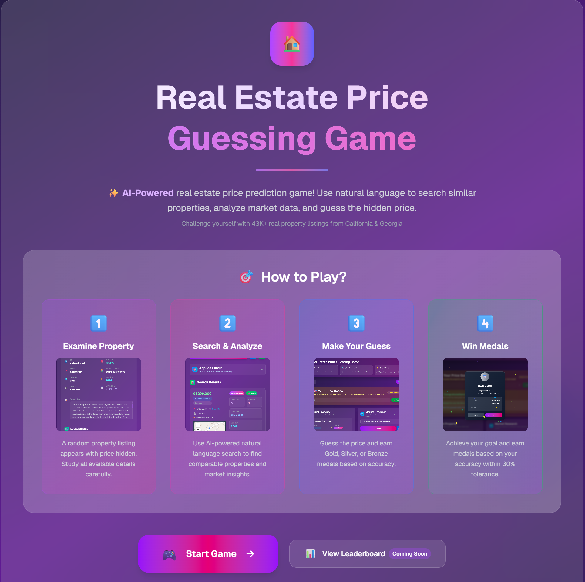
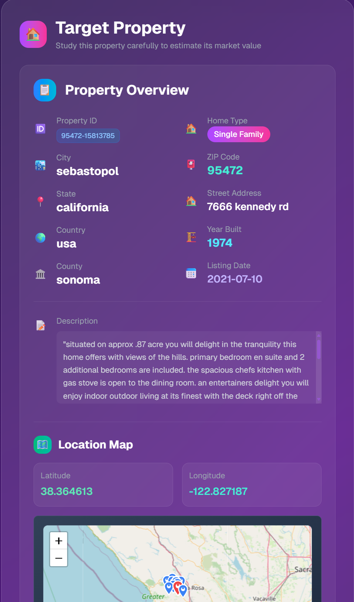
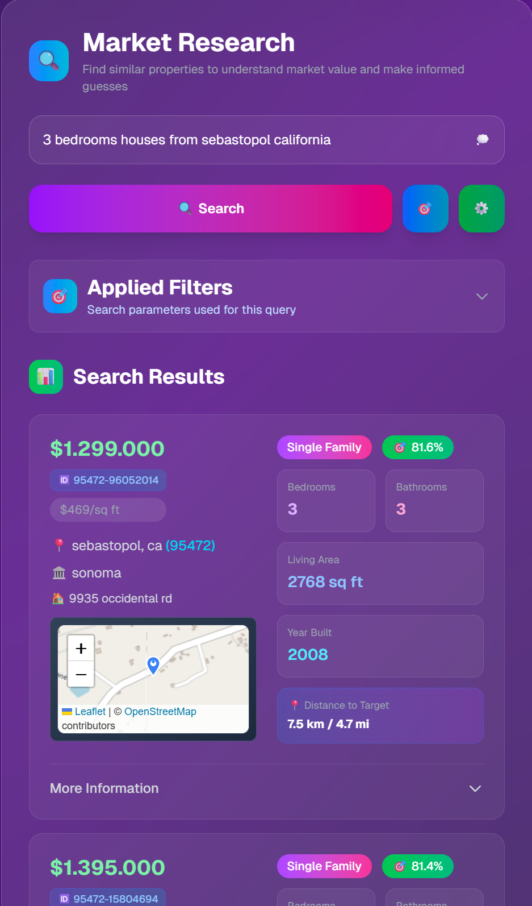
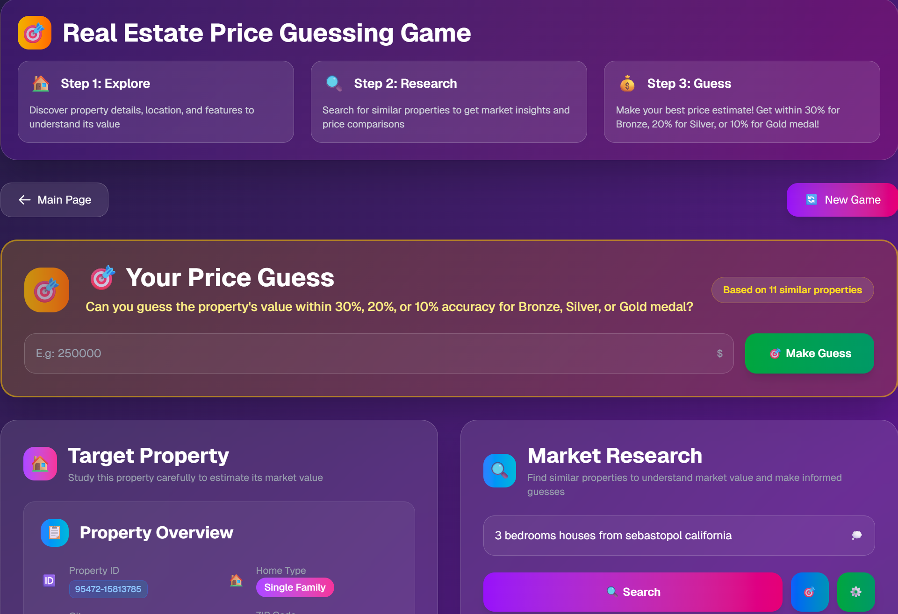

# Real Estate Price Guessing Game



An AI-powered real estate price prediction game where players guess hidden property prices using natural language search and market analysis. Challenge yourself with 43K+ real property listings from California & Georgia!

## 🎯 Features

- **Random Property Challenge**: A random property listing appears with price hidden - study all available details carefully
- **AI-Powered Search**: Use natural language queries to find comparable properties and gain market insights
- **Interactive Map**: Visualize property locations and explore the neighborhood
- **Medal System**: Earn Gold (±10% accuracy), Silver (±20%), or Bronze (±30%) medals based on your guess accuracy
- **Advanced Filtering**: Apply multiple filters including price range, bedrooms, bathrooms, property type, and more
- **Weight Customization**: Adjust search weights for different property attributes to fine-tune your analysis

## 🛠️ Tech Stack

### Frontend
- **Next.js 15** - React framework with App Router
- **TypeScript** - Type-safe JavaScript
- **Tailwind CSS** - Utility-first CSS framework
- **Leaflet** - Interactive maps
- **React Confetti** - Celebration animations

### Backend
- **Python 3.12** - Programming language
- **Superlinked** - Multimodal, AI powered search framework
- **Qdrant** - Vector database for similarity search

### Infrastructure
- **Docker & Docker Compose** - Containerization and orchestration
- **NVIDIA GPU Support** - Hardware acceleration for embeddings

## 🚀 Quick Start

### Prerequisites
- Python 3.12.3
- Docker and Docker Compose
- NVIDIA GPU (optional, for faster embeddings)

### Installation & Setup

1. **Clone the repository**
   ```bash
   git clone https://github.com/gururaser/real-estate-game.git
   cd real-estate-game
   ```

2. **Create Python virtual environment**
   ```bash
   python3.12 -m venv .venv
   source .venv/bin/activate  # On Windows: .venv\Scripts\activate
   ```

3. **Install Python dependencies**
   ```bash
   pip install -r requirements.txt
   ```

4. **Download datasets**
   ```bash
   python scripts/downloader.py
   ```

5. **Preprocess the data**
   ```bash
   python scripts/preprocess.py
   ```

6. **Generate statistics for filters**
   ```bash
   python scripts/generate_statistics.py
   ```

7. **Set up environment variables**
   ```bash
   # Copy environment files for frontend
   cp frontend/.env.example frontend/.env
   
   # Copy environment files for backend
   cp superlinked_app/.env.example superlinked_app/.env
   ```

8. **Configure your environment**
   - Edit `frontend/.env` with your frontend configuration
   - Edit `superlinked_app/.env` with your Qdrant settings and other backend configurations
   - Update any other configuration as needed

9. **Start the services**
   ```bash
   # If you have NVIDIA GPU:
   docker-compose up --build

   # If you don't have NVIDIA GPU:
   docker-compose -f docker-compose.cpu.yml up --build
   ```

10. **Wait for services to be ready**
    - Frontend: http://localhost:3000
    - Superlinked API: http://localhost:8080
    - Qdrant Dashboard: http://localhost:6333

11. **Load data into the system**
    ```bash
    # Get data loader configuration
    curl http://localhost:8080/data-loader/

    # Expected response format:
    {
      "result": {
        "properties": "DataLoaderConfig(path='data/processed_real_estate.csv', format=<DataFormat.CSV: 1>, name='properties', pandas_read_kwargs={'chunksize': 512})"
      }
    }

    # Start data loading (use the 'name' value from the response, typically 'properties')
    curl -X POST http://localhost:8080/data-loader/properties/run
    ```

12. **Monitor data loading**
    - Check Superlinked service logs for data loading progress:
    ```bash
    docker-compose logs -f superlinked
    ```
    - Wait until all data is loaded into Qdrant vector database
    - The process may take several minutes depending on your system

13. **Access the application**
    - Open http://localhost:3000 in your browser
    - Start playing the Real Estate Price Guessing Game!

### 📋 Notes
- A `docker-compose.cpu.yml` file has been created for systems without NVIDIA GPU
- Data loading process may take 5-15 minutes depending on your system performance
- Make sure all services are healthy before accessing the application

## 🔧 Troubleshooting

### Common Issues

**Data loading fails**
- Ensure `data/processed_real_estate.csv` exists and is not empty
- Check Superlinked service logs: `docker-compose logs superlinked`
- Verify Qdrant is running: `curl http://localhost:6333/health`

**Services won't start**
- Check if ports 3000, 8080, 6333 are available
- Ensure Docker and Docker Compose are properly installed
- For GPU version, verify NVIDIA drivers are installed

**Search not working**
- Confirm data has been loaded successfully
- Check Superlinked API health: `curl http://localhost:8080/health`
- Verify environment variables in `.env` files

**Frontend not loading**
- Ensure Node.js dependencies are installed: `cd frontend && npm install`
- Check if Next.js dev server is running
- Verify all backend services are healthy

## 🎮 How to Play

1. **Examine Property**: A random property listing appears with price hidden. Study all available details carefully.
   

2. **Search & Analyze**: Use AI-powered natural language search to find comparable properties and market insights. Examples:
   - "3 bedroom houses in similar neighborhoods"
   - "properties with similar square footage and amenities"
   - "recent sales in this zip code"
   

3. **Make Your Guess**: Enter your estimated price and submit your guess.
   

4. **Win Medals**: Achieve accuracy within 30% tolerance to earn medals:
   - 🥇 Gold Medal: Within ±10% of actual price
   - 🥈 Silver Medal: Within ±20% of actual price
   - 🥉 Bronze Medal: Within ±30% of actual price
   

## 📊 Data

The game uses real property data from:
- **California** real estate listings ([Kaggle Dataset](https://www.kaggle.com/datasets/yellowj4acket/real-estate-california))
- **Georgia** real estate listings ([Kaggle Dataset](https://www.kaggle.com/datasets/yellowj4acket/real-estate-georgia))
- **43K+ properties** with comprehensive details including:
  - Price and price per square foot
  - Property details (bedrooms, bathrooms, living area)
  - Location data (address, city, county, coordinates)
  - Property features (pool, garage, parking, etc.)
  - Market information (year built, property type, etc.)

## 🔧 Configuration

### Search Weights
Customize how different property attributes affect search similarity:
- Description weight
- Location weights (city, street address, county)
- Price-related weights
- Property feature weights

### Filters
Apply various filters to refine your search:
- Price range
- Number of bedrooms/bathrooms
- Property type
- Location filters
- Boolean features (pool, garage, etc.)

## 🏗️ Project Structure

```
real-estate-game/
├── frontend/                 # Next.js React application
│   ├── src/
│   │   ├── app/
│   │   │   ├── page.tsx      # Landing page
│   │   │   ├── game/         # Game page and components
│   │   │   └── components/   # Shared components
│   │   └── ...
│   ├── package.json
│   └── Dockerfile
├── superlinked_app/          # Python backend with Superlinked
│   ├── api.py               # Superlinked API application
│   ├── index.py             # Vector index configuration
│   ├── query.py             # Search query definitions
│   ├── config.py            # Application configuration
│   ├── filters.py           # Search filters
│   └── Dockerfile
├── scripts/                  # Data processing scripts
│   ├── preprocess.py        # Data preprocessing
│   ├── generate_statistics.py # Statistics generation
│   └── downloader.py        # Data downloading
├── data/                     # Property data and statistics
│   ├── RealEstate_California.csv
│   ├── RealEstate_Georgia.csv
│   ├── processed_real_estate.csv
│   └── column_statistics.json
├── docker-compose.yml        # Docker orchestration
└── requirements.txt          # Python dependencies
```

## 🔍 API Endpoints

### API Endpoints
- `POST /api/v1/search/property` - Natural language property search
- `GET /health` - Health check endpoint
- `GET /data-loader/` - Get data loader configuration
- `POST /data-loader/{name}/run` - Start data loading process

### Qdrant
- `POST /collections/default/points/query` - Query random property from vector database
- Vector similarity search for property matching
- REST API on port 6333
- gRPC API on port 6334

## 🤝 Contributing

1. Fork the repository
2. Create a feature branch (`git checkout -b feature/amazing-feature`)
3. Commit your changes (`git commit -m 'Add amazing feature'`)
4. Push to the branch (`git push origin feature/amazing-feature`)
5. Open a Pull Request

## 📝 License

This project is licensed under the Apache License 2.0 - see the [LICENSE](LICENSE) file for details.

## 🙏 Acknowledgments

- **Superlinked** - Multimodal, AI powered search framework
- **Qdrant** - High-performance vector database
- **OpenStreetMap** - Map data and tiles
- **Real estate data providers** - Property listing data

## 📞 Contact

**Gurur Aşer**
- LinkedIn: [linkedin.com/in/gururaser](https://www.linkedin.com/in/gururaser/)
- GitHub: [github.com/gururaser](https://github.com/gururaser)

---

*Built with ❤️ using Next.js, Superlinked, and Qdrant*